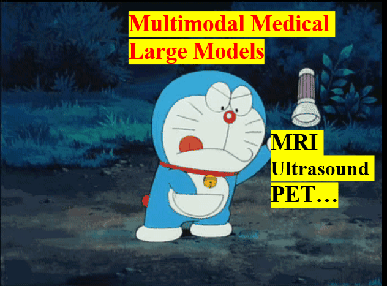

# Awesome-Multimodal-Medical-Large-Models

🔥  This is a collection of awesome (not comprehensive but high quality) papers about *Multimodal Medical Data Analysis*

✅ Continue update 2024.1.15

😊 If you have any recommended papers, pls feel free to contact me ([Email](larrypengliang@gmail.com) or WeChat: pl15828102252)

# Papers

1. 📜 **Towards Generalist Biomedical AI (Med-PaLM M)** 🔥 
    - 🗓️ Date: 2023.07
    - 📖 arXiv
    - 🧑‍ Authors: Tao Tu, Shekoofeh Azizi, Danny Driess, Mike Schaekermann, et.al.,
    - 📄 [PDF](https://arxiv.org/pdf/2307.14334.pdf)
    - 💻 [GitHub](https://github.com/kyegomez/Med-PaLM)
    - 📌 Keys: Foundation model; Multi-modalities; Multi-tasks
    - 🔬 Datasets: MultiMedBench

2. 📜 **Towards Generalist Foundation Model for Radiology by Leveraging Web-scale 2D&3D Medical Data** 🔥 
    - 🗓️ Date: 2023.07
    - 📖 arXiv
    - 🧑‍ Authors: Chaoyi Wu, Xiaoman Zhang, Ya Zhang, Yanfeng Wang, Weidi Xie
    - 📄 [PDF](https://arxiv.org/pdf/2308.02463.pdf)
    - 💻 [GitHub](https://github.com/chaoyi-wu/RadFM)
    - 📌 Keys: Foundation model, multi-modalities, multi-tasks
    - 🔬 Datasets: MedMD; RadMD
    
3. 📜 **CLIP in medical imaging: A comprehensive survey**
    - 🗓️ Date: 2023.12
    - 📖 arXiv
    - 🧑‍ Authors: Zihao Zhao, Yuxiao Liu, Han Wu, Yonghao Li, Sheng Wang, Lin Teng, Disheng Liu, Zhiming Cui, Qian Wang, Dinggang Shen
    - 📄 [PDF](https://arxiv.org/pdf/2312.07353.pdf)
    - 💻 [GitHub](https://github.com/zhaozh10/Awesome-CLIP-in-Medical-Imaging)
    - 📌 Keys: CLIP; Survey

4. 📜 **CLIPSyntel: CLIP and LLM Synergy for Multimodal Question Summarization in Healthcare**
    - 🗓️ Date: 2023.12
    - 📖 AAAI 2024
    - 🧑‍ Authors: Akash Ghosh, Arkadeep Acharya, Raghav Jain, Sriparna Saha, Aman Chadha, Setu Sinha
    - 📄 [PDF](https://arxiv.org/pdf/2312.11541.pdf)
    - 💻 [GitHub](https://github.com/AkashGhosh/CLIPSyntel-AAAI2024)
    - 📌 Keys: CLIP; LLM; Question-summarization
    - 🔬 Datasets: MMQS

5. 📜 **Multimodal biomedical AI**
    - 🗓️ Date: 2022.09
    - 📖 Nature Medicine 2022
    - 🧑‍ Authors: Julián N. Acosta, Guido J. Falcone, Pranav Rajpurkar, Eric J. Topol 
    - 📄 [PDF](https://www.nature.com/articles/s41591-022-01981-2)
    - 📌 Keys: Multimodal; Survey

6. 📜 **A Survey of Large Language Models in Medicine: Principles, Applications, and Challenges**
    - 🗓️ Date: 2023.11
    - 📖 arXiv
    - 🧑‍ Authors:Hongjian Zhou, Fenglin Liu, Boyang Gu, Xinyu Zou, Jinfa Huang, Jinge Wu, Yiru Li, Sam S. Chen, Peilin Zhou, Junling Liu, Yining Hua, Chengfeng Mao, Xian Wu, Yefeng Zheng, Lei Clifton, Zheng Li, Jiebo Luo, David A. Clifton
    - 📄 [PDF](https://arxiv.org/pdf/2311.05112.pdf)
    - 💻 [GitHub](https://github.com/AI-in-Health/MedLLMsPracticalGuide)
    - 📌 Keys: LLM; Survey

7. 📜 **Large-scale Long-tailed Disease Diagnosis on Radiology Images**🔥
    - 🗓️ Date: 2023.12
    - 📖 arXiv
    - 🧑‍ Authors:Qiaoyu Zheng, Weike Zhao, Chaoyi Wu, Xiaoman Zhang, Ya Zhang, Yanfeng Wang, Weidi Xie
    - 📄 [PDF](https://arxiv.org/pdf/2312.16151)
    - 💻 [GitHub](https://github.com/qiaoyu-zheng/RP3D-Diag)
    - 📌 Keys: Foundation model; Multi-modalities; Multi-tasks
    - 🔬 Datasets:  ICD-10-CM

8. 📜 **On the Challenges and Perspectives of Foundation Models for Medical Image Analysis**
    - 🗓️ Date: 2023.06
    - 📖 arXiv
    - 🧑‍ Authors:Shaoting Zhang, Dimitris Metaxas
    - 📄 [PDF](https://arxiv.org/pdf/2306.05705.pdf)
    - 📌 Keys: Foundation model; Challenges and Perspectives; Survey

9. 📜 **One Model to Rule them All: Towards Universal Segmentation for Medical Images with Text Prompts**🔥
    - 🗓️ Date: 2023.12
    - 📖 arXiv
    - 🧑‍ Authors:Ziheng Zhao, Yao Zhang, Chaoyi Wu, Xiaoman Zhang, Ya Zhang, Yanfeng Wang, Weidi Xie
    - 📄 [PDF](https://arxiv.org/abs/2312.17183)
    - 💻 [GitHub](https://zhaoziheng.github.io/MedUniSeg/)
    - 📌 Keys: Foundation model; Segmentation;  Multimodal Knowledge

10. 📜 **Med-Flamingo: a Multimodal Medical Few-shot Learner**
    - 🗓️ Date: 2023.07
    - 📖 arXiv
    - 🧑‍ Authors:Michael Moor, Qian Huang, Shirley Wu, Michihiro Yasunaga, Cyril Zakka, Yash Dalmia, Eduardo Pontes Reis, Pranav Rajpurkar, Jure Leskovec
    - 📄 [PDF](https://arxiv.org/pdf/2307.15189.pdf)
    - 💻 [GitHub](https://github.com/snap-stanford/med-flamingo)
    - 📌 Keys: VQA; Few-shot learning; Fine-turning

11. 📜 **MedCLIP: Contrastive Learning from Unpaired Medical Images and Text**
    - 🗓️ Date: 2022.10
    - 📖 EMNLP 2022
    - 🧑‍ Authors:Zifeng Wang, Zhenbang Wu, Dinesh Agarwal, Jimeng Sun
    - 📄 [PDF](https://arxiv.org/pdf/2307.15189.pdf)
    - 💻 [GitHub](https://github.com/RyanWangZf/MedCLIP)
    - 📌 Keys: CLIP; Zero-shot

12. 📜 **PMC-CLIP: Contrastive Language-Image Pre-training using Biomedical Documents**
    - 🗓️ Date: 2023.03
    - 📖 MICCAI 2023
    - 🧑‍ Authors:Weixiong Lin, Ziheng Zhao, Xiaoman Zhang, Chaoyi Wu, Ya Zhang, Yanfeng Wang, Weidi Xie
    - 📄 [PDF](https://arxiv.org/pdf/2307.15189.pdf)
    - 💻 [GitHub](https://github.com/WeixiongLin/PMC-CLIP)
    - 📌 Keys: CLIP;  Image-caption construction

13. 📜 **Foundational Models in Medical Imaging: A Comprehensive Survey and Future Vision**
    - 🗓️ Date: 2023.10
    - 📖 arXiv
    - 🧑‍ Authors:Bobby Azad, Reza Azad, Sania Eskandari, Afshin Bozorgpour, Amirhossein Kazerouni, Islem Rekik, Dorit Merhof
    - 📄 [PDF](https://arxiv.org/pdf/2310.18689.pdf)
    - 💻 [GitHub](https://github.com/xmindflow/Awesome-Foundation-Models-in-Medical-Imaging)
    - 📌 Keys: Foundational models;  Survey

14. 📜 **MedBLIP: Bootstrapping Language-Image Pre-training from 3D Medical Images and Texts**
    - 🗓️ Date: 2023.06
    - 📖 arXiv
    - 🧑‍ Authors: Bang Yang, Asif Raza, Yuexian Zou, Tong Zhang
    - 📄 [PDF](https://arxiv.org/pdf/2306.05642.pdf)
    - 💻 [GitHub](https://github.com/Qybc/MedBLIP)
    - 📌 Keys: BLIP2; VQA

15. 📜 **Sam-Guided Enhanced Fine-Grained Encoding with Mixed Semantic Learning for Medical Image Captioning**
    - 🗓️ Date: 2023.11
    - 📖 arXiv
    - 🧑‍ Authors: Zhenyu Zhang, Benlu Wang, Weijie Liang, Yizhi Li, Xuechen Guo, Guanhong Wang, Shiyan Li, Gaoang Wang
    - 📄 [PDF](https://arxiv.org/pdf/2311.01004.pdf)
    - 📌 Keys: BLIP2; SAM

16. 📜 **Path to Medical AGI: Unify Domain-specific Medical LLMs with the Lowest Cost**
    - 🗓️ Date: 2023.06
    - 📖 arXiv
    - 🧑‍ Authors: Juexiao Zhou and Xiuying Chen and Xin Gao
    - 📄 [PDF](https://arxiv.org/pdf/2306.10765.pdf)
    - 💻 [GitHub](https://github.com/JoshuaChou2018/MedAGI)
    - 📌 Keys: MedChat

# Base papers

1. 📜 **CLIP**
    - 🗓️ Date: 2021.3
    - 📖 ICML 2021
    - 🧑‍ Authors: Alec Radford, Jong Wook Kim, Chris Hallacy, Aditya Ramesh, Gabriel Goh, Sandhini Agarwal, Girish Sastry, Amanda Askell, Pamela Mishkin, Jack Clark, Gretchen Krueger, Ilya Sutskever
    - 📄 [PDF](https://arxiv.org/pdf/2103.00020.pdf)
    - 💻 [GitHub](https://github.com/openai/CLIP)
    - 📌 Keys: Contrastive Language-Image Pre-Training

2. 📜 **MaPLe: Multi-modal Prompt Learning**
    - 🗓️ Date: 2023
    - 📖 CVPR 2023
    - 🧑‍ Authors: Muhammad Uzair Khattak, Hanoona Rasheed, Muhammad Maaz, Salman Khan, Fahad Shahbaz Khan
    - 📄 [PDF](https://arxiv.org/pdf/2210.03117.pdf)
    - 💻 [GitHub](https://github.com/muzairkhattak/multimodal-prompt-learning)
    - 📌 Keys: Multi-modal Prompt, based on ClIP

3. 📜 **Meta-Transformer: A Unified Framework for Multimodal Learning**
    - 🗓️ Date: 2023
    - 📖 CVPR 2023
    - 🧑‍ Authors: Yiyuan Zhang, Kaixiong Gong, Kaipeng Zhang, Hongsheng Li, Yu Qiao, Wanli Ouyang, Xiangyu Yue
    - 📄 [PDF](https://arxiv.org/pdf/2307.10802.pdf)
    - 💻 [GitHub](https://github.com/invictus717/MetaTransformer)
    - 📌 Keys: Unified multi-modal Modal, token is all you need

4. 📜 **ImageBind: One Embedding Space To Bind Them All**
    - 🗓️ Date: 2023
    - 📖 CVPR 2023
    - 🧑‍ Authors: Rohit Girdhar, Alaaeldin El-Nouby, Zhuang Liu, Mannat Singh, Kalyan Vasudev Alwala, Armand Joulin, Ishan Misra
    - 📄 [PDF](https://arxiv.org/pdf/2305.05665.pdf)
    - 💻 [GitHub](https://facebookresearch.github.io/ImageBind)
    - 📌 Keys: Unified multi-modal Modal, token is all you need

5. 📜 **BLIP-2: Bootstrapping Language-Image Pre-training with Frozen Image Encoders and Large Language Models**
    - 🗓️ Date: 2023.01
    - 📖 ICML 2023
    - 🧑‍ Authors: Junnan Li, Dongxu Li, Silvio Savarese, Steven Hoi
    - 📄 [PDF](https://arxiv.org/pdf/2301.12597.pdf)
    - 💻 [GitHub](https://github.com/salesforce/LAVIS/tree/main/projects/blip2)
    - 📌 Keys: Multi-modal; Q-Former
# Related papers

## SAM

## LLM

1. 📜 **Pixel Aligned Language Models**
    - 🗓️ Date: 2023.12
    - 📖 arXiv
    - 🧑‍ Authors: Jiarui Xu, Xingyi Zhou, Shen Yan, Xiuye Gu, Anurag Arnab, Chen Sun, Xiaolong Wang, Cordelia Schmid
    - 📄 [PDF](https://arxiv.org/pdf/2312.09237.pdf)
    - 💻 [GitHub](https://jerryxu.net/PixelLLM/)
    - 📌 Keys: LLM

2. 📜 **PixelLM: Pixel Reasoning with Large Multimodal Model**
    - 🗓️ Date: 2023.12
    - 📖 arXiv
    - 🧑‍ Authors: Zhongwei Ren, Zhicheng Huang, Yunchao Wei, Yao Zhao, Dongmei Fu, Jiashi Feng, Xiaojie Jin
    - 📄 [PDF](https://arxiv.org/pdf/2312.09237.pdf)
    - 💻 [GitHub](https://pixellm.github.io/)
    - 📌 Keys: LLM

3. 📜 **SPAE: Semantic Pyramid AutoEncoder for Multimodal Generation with Frozen LLMs**
    - 🗓️ Date: 2023.06
    - 📖 NeurIPS 2023
    - 🧑‍ Authors: Lijun Yu, Yong Cheng, Zhiruo Wang, Vivek Kumar, Wolfgang Macherey, Yanping Huang, David A. Ross, Irfan Essa, Yonatan Bisk, Ming-Hsuan Yang, Kevin Murphy, Alexander G. Hauptmann, Lu Jiang
    - 📄 [PDF](https://arxiv.org/pdf/2306.17842.pdf)
    - 📌 Keys: LLM; Multimodal

# Multimodal medical datasets

| Name             | Modality                              | Size  | Task | Organ | Link |
|------------------|---------------------------------------|-------|------|-------|------|
| ADNI             | MRI, PET, fMRI, clinical, Gene, Table |       |      |       |      |
| ABIDE            | MRI, PET                              |       |      |       |      |
| INSPECT          |                                       |       |      |       |      |
| MIMIC-CXR        | X-ray-text pairs                      |       |      |       |      |
| UK Biobank       |                                       |       |      |       |      |
| MultiMedBench    |                                       |       |      |       |      |
| MedMD            |                                       |       |      |       |      |
| RadMD            |                                       |       |      |       |      |
| ICD-10-CM        |                                       |       |      |       |      |
| TCGA(-LUAD/STAD) | WSIs, clinical, Gene                  |       |      |       |      |
| MedICaT          | CT-text pairs                         |       |      |       |      |
| ROCO             | CT-text pairs                         | 217K  |      |       |      |
